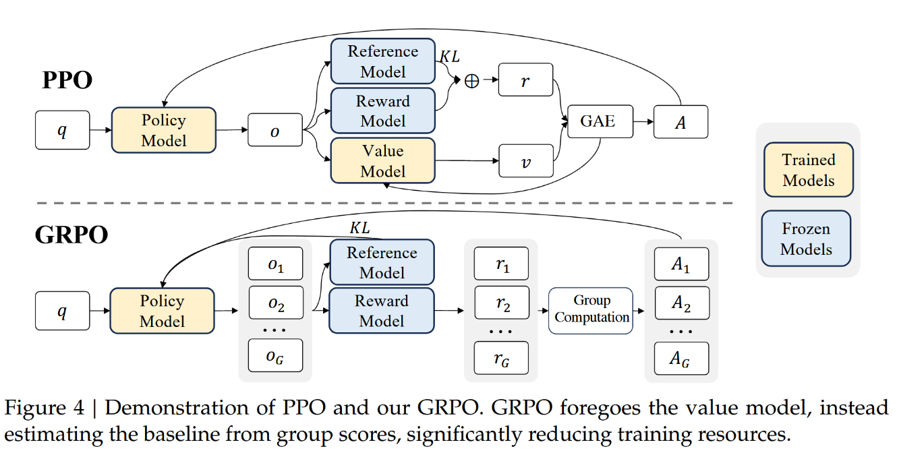
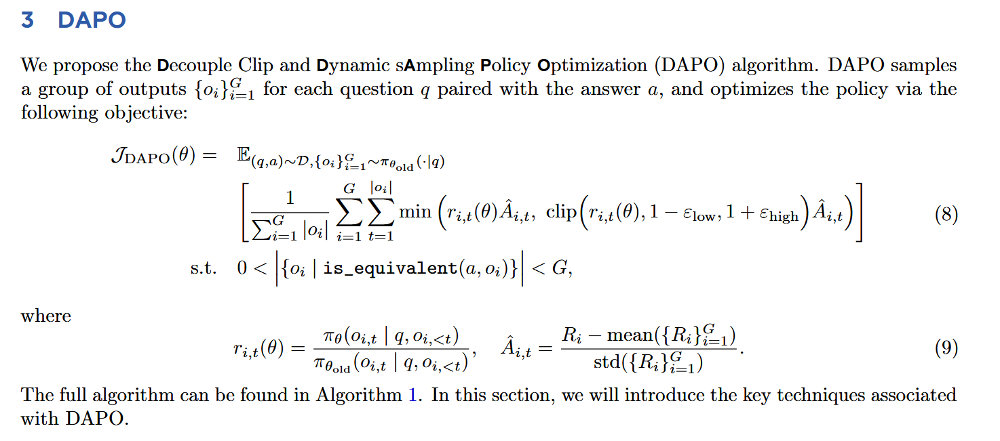

# 强化学习基本符号概念
## 策略
### 确定性策略
在状态S的情况下，确定的执行动作。比如时间到12点（状态），执行吃午饭（动作）。

 $ a_t = μ(s_t) $

### 随机性策略
状态S的情况下，可以执行的策略实际上是一个概率分布。例如，12点时，可能吃午饭（二分之一的概率），也可能不吃（二分之一的概率）。

$ a_t \sim π_\theta(.|s_t)  $

## 奖励
### 单步奖励
仅仅代表当前状态下执行某个动作到下一个状态的奖励，与策略无关

$ r_t = R(s_t,a_t,s_{t+1}) $

### T步累计奖励
一条运动轨迹中的所有奖励累计。（运动轨迹这里是指从初始状态由于采取一系列动作到最终状态的整个过程）
$ R(\tau) = \Sigma^{T-1}_{0}r_t $
这里可以看到一共是T个时间步
### 折扣奖励
$ R(\tau) = \Sigma_{t=0}^{\infty}\gamma^{t}r_t $
为了使得最近的奖励与之后的奖励变得不同等的重要，引入一个因子$\gamma$ ,这里$\gamma \in (0,1) $

## 轨迹
$ \tau = (s_0,a_0,r_0,s_1,a_1,r_1,\dots s_{T-1},a_{T-1},r_{T-1})$

## 策略的梯度上升（PG）
$ arg\max_{\pi_{\theta}} J(\pi_{\theta}) = E_{\tau \sim \pi_{\theta}}[R(\tau)]$

解释就是我们要做的事情是找到符合条件的参数$\theta$使得$J(\pi_{\theta})$最大。

而$J(\pi_{\theta})$的含义即为在策略中采样得到的轨迹获得的奖励的均值。

对于某一条采样得到的轨迹，所获得的奖励好不好当然无法反应出这个策略整体是否良好。

这里对该目标求梯度：

$\nabla J(\pi_{\theta}) = \sum_{\tau}R(\tau)\nabla P(\tau | \pi_{\theta})$

最终形式为

$ \nabla J(\pi_{\theta}) = E_{\tau \sim \pi_{\theta}} [R(\tau)\sum_{t=0}^{T-1} \nabla \log \pi_{\theta}(a_t|s_t)]$

其中$\nabla \log \pi_{\theta}(a_t|s_t)$代表了$s_t$状况下策略采取动作$a_t$的概率增大的方向。结合上前面乘的$R(\tau)$，直观理解为这条轨迹下奖励高那么下次采取这条轨迹的概率就变大，反之则变小。

实际过程中我们当时通过采样许多条轨迹来估计上面的期望：

$ \nabla J(\pi_{\theta}) = \frac{1}{N} \sum_{n=0}^{N-1} \sum_{t=0}^{T_n-1} R(\tau) \nabla \log \pi_{\theta}(a_t|s_t)$

即第n次采样时的时间步总共为$T_n$,先算出每次采样的轨迹奖励，然后取均值。

## 价值函数
上面的公式有一个问题在于：
* $R(\tau)$代表着整条动作轨迹的奖励，但是一条动作轨迹中，我们很难说所有动作都是好的，有可能有奖励很差的动作在里面，但是由于其他的动作获得了很高的奖励，导致最终的结果变得很好。

* 但是，最终目标是要整个动作轨迹的奖励最优，那么一定需要整个动作轨迹的全局奖励。

因此其实需要找到一个衡量单步价值与全局价值的方式，也就是两边都要关注的方式。

所以采取$R(\tau)$也许就不合适了，我们可能需要一个其他的函数。假定为$\Psi_t$

### 衡量的不同方式

第一个函数跟之前谈到的$ R(\tau) $没啥区别

第二个代表了t时刻及以后的折扣奖励，因为在马尔科夫决策过程中，首先整个过程是马尔科夫过程，因此t时刻前发生的事情跟t时刻是没关系的，t时刻发生的事情只跟t时刻之后发生的事情相关。

第三个是引入了基线（baseline）。简而言之就是从计算t时刻后的奖励的绝对数值到计算这个奖励对于其他动作的相对数值。比如可以采样一堆轨迹，然后计算所有轨迹中，状态为$s_t$到最终状态的累计奖励的均值，作为基线。

### 动作价值函数，优势函数以及TD_Error

首先动作价值函数：
$Q_{\pi}(a_t, s_t)$

含义为在某个状态$s_t$下，根据策略$\pi$采取了动作$a_t$所带来的价值

MDP中动作价值函数的定义为：
$Q_{\pi}(a_t, s_t) = R(a_t,s_t) + \gamma \sum_{s \in S} P(s|s_t, a_t)V(s) $

可见这个函数表达的是状态$s_t$下，根据策略$\pi$采取动作$a_t$的当前奖励$R(a_t,s_t)$，加上当前状态转移到其他状态的价值的均值$\gamma \sum_{s \in S} P(s|s_t, a_t)V(s)$，其中$\gamma$为前面提到的折扣因子。

然后价值函数：
$V_{\pi}(s_t)$

代表着状态$s_t$下，根据策略$\pi$采取一系列动作到达最终状态后的奖励的期望。

MDP中价值函数的定义为：

$V_{\pi}(s_t) = \sum_{a \in A} \pi(a|s_t) Q_\pi(a, s_t)$

其中A代表整个动作空间。

然后优势函数；
$A_{\pi}(s_t, a_t) = Q_{\pi}(a_t, s_t) -V_{\pi}(s_t) $

这个差值衡量了某个状态$s_t$下，根据策略$\pi$执行某个动作比其他的动作要好多少，那么这个优势函数可以合理的替换上述的$R(\tau)$。

这里给出价值函数的原子定义：
$V_{\pi}(s_t) = E_{\pi}[G_t|s_t]$
$ G_t = r_t + \gamma r_{t+1} +\dots+ \gamma^{T-t-1} r_{T-1}$

是累积折扣奖励，其中$r_t$代表某一时间步获得的奖励

$V_{\pi}(s_t) = E_{\pi}[r_t|s_t] + E_{\pi}[\gamma V(s_{t+1})|s_t]$
    $= \sum_{a_t \in A} \pi(a_t, s_t)\sum_{s_{t+1} \in S} P(s_{t+1}|s_t, a_t)R(s_{t+1}, s_t, a_t) + \gamma \sum_{a_t \in A} \pi(a_t, s_t) \sum_{s_{t+1} \in S} P(s_{t+1}|s_t, a_t)V_{\pi}(s_{t+1})$

$V_{\pi}(s_t) = \sum_{a_t \in A} \pi(a_t, s_t)\sum_{s_{t+1} \in S} P(s_{t+1}|s_t, a_t)[r_t + \gamma V_{\pi}(s_{t+1})]$

得到最终的表示：

$V_{\pi}(s_t) = E_{a_t \sim \pi(.|s_t)}[E_{s_{t+1} \sim P(.|s_t,a_t)}[r_t + \gamma V_{\pi}(s_{t+1})]]$

同理得到动作价值函数的表示：

$Q_{\pi}(s_t,a_t) = E_{s_{t+1} \sim P(.|s_t,a_t)}[r_t + \gamma V_{\pi}(s_{t+1})]$

观察到其实价值函数就是动作价值函数在策略意义上的期望。

下面说说TD_error。

我们取了动作价值函数与价值函数的差值作为优势：

$A_{\pi}(s_t, a_t) = Q_{\pi}(a_t, s_t) -V_{\pi}(s_t) $

改写上面的价值函数形式为：

$V_{\pi}(s_t) = E_{s_{t+1} \sim P(.|s_t,a_t)}[V_{\pi}(s_{t})]$

这个式子显然正确的，含义是对状态为$s_t$的价值函数求$s_{t+1}$状态下的期望，所以相当于：

$V_{\pi}(s_t) = V_{\pi}(s_t)$

这么改写主要是方便给出优势函数的表达式：

$A_{\pi}(s_t, a_t) = E_{s_{t+1} \sim P(.|s_t,a_t)}[r_t + \gamma V_{\pi}(s_{t+1})] -E_{s_{t+1} \sim P(.|s_t,a_t)}[V_{\pi}(s_{t})] $

$A_{\pi}(s_t, a_t) = E_{s_{t+1} \sim P(.|s_t,a_t)}[r_t + \gamma V_{\pi}(s_{t+1}) - V_{\pi}(s_{t})] $

$A_{\pi}(s_t, a_t) = E_{s_{t+1} \sim P(.|s_t,a_t)}[TDerror] $

于是TDerror就为:

$ TDerror = r_t + \gamma V(s_{t+1}) - V_{\pi}(s_{t}) $

这里也可以看出如果$V_{\pi}(s_{t})$是准的，那么6是5的无偏估计。

## 演员-评论家（Actor-Critic）

回顾之前定义的策略梯度：

$ \nabla J(\pi_{\theta}) = E_{\tau \sim \pi_{\theta}} [\sum_{t=0}^{T-1} \Psi_t \nabla \log \pi_{\theta}(a_t|s_t)]$

$ \nabla J(\pi_{\theta}) \approx \frac{1}{N} \sum_{n=0}^{N-1} \sum_{t=0}^{T_n-1} \Psi_t \nabla \log \pi_{\theta}(a_t|s_t)$

我们选择第6种方式TDerror作为衡量标准。

在actor-critic方法下，我们用神经网络 $\theta$ 来表示策略（actor），神经网络 $\phi$ 来表示价值（critic），所以这里我们进一步把 $V_{\pi}$ 写成 $V_{\theta}$ 和 $V_{\phi}$ 。

### Actor优化目标

将优化目标写成以下形式：

$ arg\max_{\theta} J(\pi_{\theta}) = E_{\tau \sim \pi_{\theta}} [\sum_{t=0}^{T-1} A_{\phi}(s_t,a_t)  \log \pi_{\theta}(a_t|s_t)]$

$ arg\max_{\theta} J(\pi_{\theta}) \approx \frac{1}{N} \sum_{n=0}^{N-1} \sum_{t=0}^{T_n-1} (r_t + \gamma V_{\phi}(s_{t+1}) - V_{\phi}(s_{t}))  \log \pi_{\theta}(a_t|s_t)$

### Critic优化目标

$ arg\min_{V_{\phi}} L(V_{\phi}) = E_{t} [(r_t + \gamma V_{\phi}(s_{t+1}) - V_{\phi}(s_{t}))^2]$

这里解释下为什么是使得TDerror最小。

假设考试的时候，在当前状态$s_t$估计我的总分为$V_{\phi}(s_t)$,做完一道题后（采取动作），状态转换到$s_{t+1}$并且获得了这道题目所对应的分数奖励$r_t$,此时继续估计我的总分$V_{\phi}(s_{t+1})$。

如果是全知全能的神来估计，他知道所有事件如何发展，那么我们可以肯定他所计算的$r_t + \gamma V_{\phi}(s_{t+1}) - V_{\phi}(s_{t})$,也就是此时的TDerror绝对为0。

假设他并没有那么全知全能，这里的TDerror就可能不为0，也就是说他预言的不对，而这个神要是想要提升自己的能力直到全知全能，那么他必须汲取之前的经验使得自己之后做出的预言是不矛盾的，也就是让$r_t + \gamma V_{\phi}(s_{t+1}) - V_{\phi}(s_{t})$ 趋近于 0。

## PPO

## DPO

## GRPO
### GRPO有效性的直觉分析

* PPO中使用RewardModel进行打分，例如模型对于某个q生成了回答a，于是q，a被放入奖励模型中进行打分，根据分数来估计这次回答是否良好。
* 但是，RewardModel训练时是通过文本对训练的，他会比较两个文本对哪个好哪个差，给好的打高分，给差的打低分，这就意味着，也许RewardModel根本不擅长一个绝对的衡量，他只擅长比较，因为在RewardModel训练时就没有给他一个是好是坏绝对的标准。
* 这种天性使得PPO这个方法用RewardModel对模型的某个回答打分时出现了问题，因为RewardModel本身可能都不太明白这次回答有多好，对于不同的问题，他给出的分数方差是相当大的，是没有统一标准的。
* 因此GRPO解决这个问题的方案就是：既然RewardModel擅长的不是给出绝对标准而是相对关系，直观而言就是对答案进行排序，那我就只让你做你擅长的工作。现在让模型根据同一个问题生成一组答案，由RewardModel进行打分，然后将这个分数进行归一化作为每个答案的优势。
* 这样做的好处在于，RewardModel对于一个问题的不同答案是能给的清楚相对关系的，他很擅长分辨同一问题下的答案哪个是好的哪个是坏的，因此避免了PPO对于不同问题乱给分的问题，从而使得优势的最终结果更加公正，更有代表性。

值得一提的是GRPO把待优化策略与参考策略的KL散度惩罚项从r中挪到了整个待优化函数的最后面。
## DAPO
### DAPO vs GRPO
GRPO在工业界被大规模采用后人们发现了很多问题所在：
1. 模型能力本身不足的情况下奖励过于稀疏，导致了训练过程的不稳定。
2. 切片和KL散度对模型的约束极大程度的影响了模型的探索性。

针对以上问题，DAPO应运而生。

### DAPO
首先的优化是直接拿掉KL散度，原本KL散度是用来限制模型的输出不要偏离参考模型太远，但是对于长思考链推理模型而言，模型本身就会偏离参考模型很远，因此这个KL散度就不必要了。

PS：感觉这里有文章可做，有没有KL散度对于强化学习结果的影响，进而也许能做个动态KL散度。

PS:了解DPO和GRPO后其实能看出来学校实验室与企业内部对于某个具体问题的解决方案是不尽相同的。DPO刻画了一个完美前提下的优化过程，这个过程快捷而简单，甚至不需要使用其他模型去估计价值。这种做法刚需一个巨大且优质的数据集，而且最终主要的作用还是利于模型训练，减少了训练的计算成本。这是一个偏理论上的方案，给人的感觉是如果如何如何，那就如何如何，一定是要有一个美丽的“如果”。从另一个角度来看，高校实验室所拥有的计算资源与企业相比隔着一条完全无法跨越的鸿沟，因此能做的实验也是要求计算尽可能少的，在这个前提下，当然只有将解决问题的重点转移到减少计算量，即使这样会带来更大的数据收集的问题，但是毕竟很难有十全十美的事情，选择了一个方向，也就意味着放弃了一些方向，这是高校实验室不得不做出的妥协。

PS：以上看法非常浅薄，仅仅是从资源这一个维度去分析，有点想当然的味道，一种办法永远是建立在某些边界条件下去解决问题而提出的，哪方面是不得不解决的就得处理哪方面。

PS:
* PPO采用了四模型的形式的进行LLM的强化学习，这是memory与compute双依赖的一种方式，非常的吃算力资源。
* DPO采用了极简主义，只要求训练用的数据优质，本身只需要运行两个模型即可，但是DPO的loss本质上是对比学习的交叉熵损失函数，意味着并没有强化模型本身的探索能力。这对于模型本身的能力非常依赖，也就是一个冷启动的问题：我首先得看得出来不一样我才会有对比，有对比才能学习。
* GRPO使用的是一个折中的路线，对于一些客观真理的训练非常出色，但是问题还是在于冷启动，模型能力本身不足的情况下奖励过于稀疏，导致了训练过程的不稳定。因此DeepSeek使用GRPO获得如此成功，也有其数据量足够多，模型参数本身够大的一份功劳。所以对于百万或者千万级别参数的模型的RL训练，GRPO不是最优的方案，尤其是每次训练数据量较小，比如给的BatchSize大小不够大，梯度的方差是一定会很大的，强烈的波动可能会导致训练直接崩溃掉，至少也是使得训练不稳定。
* 所以小模型，小数据批次其实更适合用带有Critic模型的方法去做，直观而言就是能力差，消耗资源请人指导是最合适的。或者就是使用大模型蒸馏一下，提升奖励的密集程度。