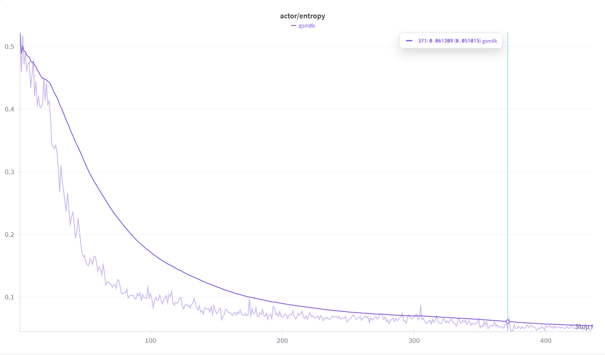
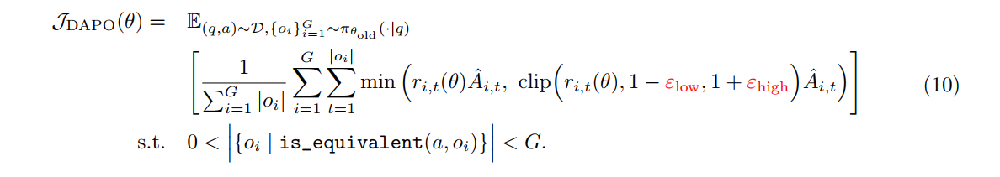

# LLM强化学习中关于熵的思考
## 模型的熵
在信息论中，熵代表着一个分布能给出的平均信息量。公式如下：

$ H(X)= - \sum_{i = 1}^{n} ​p_i \log p_i​ $

对于LLM而言，由于LLM的输出是下一个token在词汇表维度的概率分布，因此天然的具备熵这一特征。

具体而言，模型的熵如果较大，则意味着模型的输出概率分布的较为均匀，在自然语言交互的过程中，表现为回复的话语比较天马行空。而如果熵较小，那么模型的输出会有一种潜在的固定模式，极端情况下，回复会变为复读。

## 强化学习中的任务
强化学习的过程本质是一个奖惩过程，即做得好有糖果，做不好有鞭子。对于LLM而言，一个强化学习的训练过程就是对于模型输出了我们想要的token（偏好的数据），我们通过反向传播调整模型参数使得模型之后输出这个token的概率变得更大。反之，如果这个token是不好的，那么反向传播后模型输出这个token的概率会变得更小。

由此我们可以看出，强化学习的过程本质就是一个让模型输出的熵减少的过程，因为我们希望模型学会一种输出的“潜在模式”，我们希望让模型“说”我们想听的话，因此熵是必然会减少的。但是，这个减少必须是在一个可接受范围里的。

ps：这里的```可接受范围```其实应当修改为```可接受范围与合适的时机```，熵是必然会降低，但是不能不受控制的塌陷，详见后文`需要强调的是`

## 熵的崩塌



由于强化学习的任务天然的会使得模型的熵降低，在训练的不好的情况下，模型的熵甚至会直接塌陷掉。

这种崩塌现象在训练过程中的表现是Entropy曲线陡然降低，对于训练造成的影响是模型在早期的迭代中就已经形成了某种固定的格式去获得奖励，大幅限制了模型的探索。也就是说模型在最早的几步的参数就决定了最终的表现。

对于模型具体的表现而言，模型的输出可能会变为没有意义的复读，丧失了之前训练中学习到的语言能力等等。也就是说熵的崩塌是模型复读，胡言乱语的一个潜在原因。

### 需要强调的是

这里的熵崩塌问题，并不是指的是熵降低了，而是指熵不合时宜的降低了。如前文所说，熵在RL过程中是一定会降低的，这是天然要求，但是在训练中，熵不能不受控制的降低。比如过早的突然降低，会严重影响到模型的探索性，导致模型不能找到更多的解，而是形成一种固定的高奖励模式，这样一定会影响到最终的模型性能。

因此熵的控制才是关键的问题，要有目的的，合理的降低熵，而不是盲目的，胡乱的降低熵。

## 熵崩塌的解决方案

直观而言，如果想要约束熵的崩塌，必然是希望模型在训练过程中受到奖励或者惩罚时，更新参数不要过头了。因为模型熵降低就是奖惩机制导致的，反向传播会更新参数使得这个被评判的token的概率提高或降低，一旦高太多或者低太多，对于模型的熵而言都是一个使其降低的重要因素。

因此PPO之类的强化学习算法，通过裁剪函数初步抑制了过大幅度的更新，DAPO之类的解决方案则是进一步调整裁剪的阈值：



这里DAPO算法直接将裁剪的阈值解耦了。PPO算法中的裁剪的上界与下界是有超参数 $ \epsilon $ 控制的，而DAPO使用了 $ \epsilon_{low} $控制下界，$ \epsilon_{high} $控制上界。

### 关于上界下界的理解

* $ \epsilon_{low} $作为下界参数，主要是用于兜底。

    当旧策略的某个动作概率为 0.4 时，假设$ \epsilon_{low} $为 0.2 ，那么在条件相同的新策略的情况下，这个动作的概率最低不能低于 $ (1 - 0.2) \times 0.4 = 0.32 $ ，低于这个值的话直接裁剪掉并替换为 0.32 这个值。

    这种裁剪操作使得模型输出的概率能够得到一个兜底，在奖励小于0的情况下，反向传播后不会变得过于的低。

* $ \epsilon_{high} $作为上界参数，主要是用于抑制模型的探索性。
  
    也就是说当更新后的模型输出的概率比没更新的模型输出概率大太多时，这次的token也不会进行更新。

PPO中上下界是相同的，这种方法带来了很好的训练稳定性，但是考虑这样一个场景：

    假设上下界参数都为 0.2 ，对于概率为0.9的token，他最多被允许增大到 1.08 ，也就是 1.0，实际增长的比例为 11%，但是绝对数值的提升为 0.1.

    对于概率为0.01的token，他最多被允许增大到 0.012，实际增长比例为 0.2 ，但是绝对数值的提升为 0.002

问题在于这里了，高概率的token明明提升幅度比低概率的token小，但是提升的绝对数值0.1 都远远大于 0.002。也就是说PPO的裁剪看似公正，都去做了相对的裁剪，但是实际是不公正的，因为没有考虑到绝对的差异。就像抛开成本去谈性价比，假设投资100万可以获利1000万，手上刚好能拿出100万的人是赚大的，但是手上一分钱拿不出来的人是不赚的。

因此DAPO指出应该对于上下界做一个解耦，提高上界的数值。反正大概率的token再大也得小于等于1，上界数值大了对其的影响是不如对小概率token的影响的。这样做就可以由一个相对的贡献向绝对的贡献转变。
    