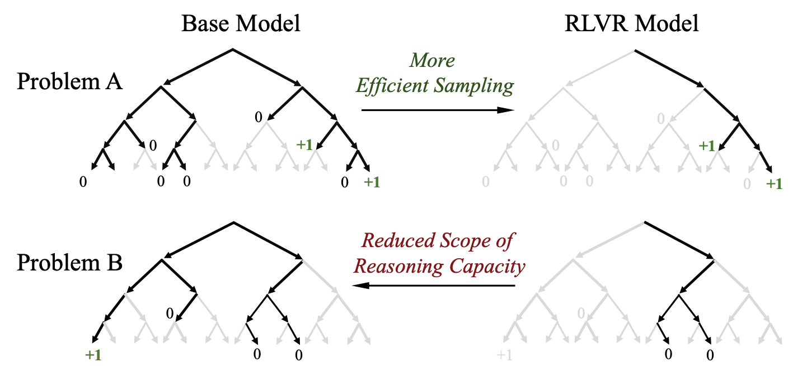

# Do We Really Need RL?
## 对强化学习的理解

llm的强化学习实际是为了使得llm的输出对齐人类的偏好而设计的训练方式，主要的优点在于：
1. **自监督的训练**：LLM进行RL训练时，最终结果的好坏实际是由正则或是另一个Reward Model评价的，并不需要人类进行标注。
2. **技多不压身** ： RL相较于同为LLM后训练过程的SFT，使得模型发生灾难性遗忘的可能性较小。
3. 

## RL这种训练方式真的能扩展模型的能力边界吗
这个问题由` Does Reinforcement Learning Really Incentivize Reasoning Capacity in LLMs Beyond the Base Model? `这篇文章中提出。

具体而言，文章的主题是：**当前所有RLVR（包括GRPO、PRM、o1-style）在推理任务上取得的进步，本质上只是把基模型已经会的东西“采样得更准”，并没有真正扩展能力边界，甚至在某些情况下还缩小了边界。**

通过以下几点论证：


* **pass@k 大逆转现象**
   * 在pass@1情况下，RL训练后的模型大幅领先Base模型
   * 在pass@64/1204的情况下，RL模型被Base模型全面反超


这张图展示了：

```
1. 对于一个跟RL训练时所使用的数据很相似的问题，这里就是Problem A，Base模型采样（理解为生成）的路径是会有很多个的，即Base模型很可能无法一次回答就能把问题完全答对，但是多问几次就可能答对了；而RL后的模型只需要一次采样（一次回答）就能获得正确的答案，大幅提升了采样的效率。
2. 但是对于Problem B而言，它是一个跟RL训练时使用的数据中不相似的一个问题，此时出现了一个现象：RL后的模型反而无法像Base模型一样采样出正确答案。这个现象是由于RL的训练缩小了模型的推理容量的空间，也就是说RL后的模型推理，或者说采样，会形成一个有偏好的方式，模型会更倾向于选择某个采样路径，而不会尝试其他路径，而Base模型由于没有经过RL训练，所以没有这种偏好，因此对于Problem B这个问题而言，多回答几次也许就答出来了。
3. 也就是说，RL实际上是在抽签+筛选（这就是后来被称为Amplifier派的思想），即RL并不能提升base模型的上限，只是在放大模型某一方面能力。

```


* **能力上限由基座模型决定**
    * 在6个模型家族、5种RL算法、4个经典推理基准上反复验证
    * 无论用什么RL方法、训多久，pass@1024 永远追不上同规模基模型
    * 基模型的pass@1024 就是铁顶，RL只能接近而不能超越
* **唯一能真正扩展边界的反而是蒸馏** 
  * 把RL模型的推理路径蒸馏回一个新模型，反而能在pass@1024上超过原基模型 → 说明“新能力”其实来自长CoT数据，而不是RL过程本身。

## 这个问题重要吗

至于RL能否扩展模型能力边界这个问题的重要程度，知乎用户@Yuuu给出的回答是：

> 有 5 个角度可供思考：
> > 1. **资源投入是否合理？** Grok4 官宣 RL 训练投入扩大了 10 倍，但普通玩家在实践中发现跑通 RL 没那么简单
> > > 1. 原生 RLer 们纷纷表示，样本效率低是 RL 界常识。例如 rollout 占据 70%～80% GPU 时间，还要考虑长尾样本
> > > 2. RL 训练拉起需要的资源是 SFT/pretrain 的几倍
> > > 3. RL 训推不同步的问题到现在仍然是个问题
> > 2. **LLM 能否自举？** RL 能让模型学会它原本不会的东西，是递归自改进的前提，如果被否定，则目前“指数进步”的叙事不可持续
> > 3. **当前评估基准是否可靠？** 如果 ` Does Reinforcement Learning Really Incentivize Reasoning Capacity in LLMs Beyond the Base Model?  ` 的观点为真，那么榜单数字很可能是假进步，并不代表模型“变聪明”
> > 4. **训练范式的方向：** 这两种思路是冲突的
> > > 1. 如果 RL 不能拓展边界，那最优配方似乎应该是 pretrain 直到撞墙-> 优质 SFT -> 蒸馏+longCoT -> 推理时大采样/multi-agent
> > > 2. 如果相反，那么预训练可以多留些余地 -> mid-train 调整分布 -> 大力 RL + 广域探索 + PRM
> > 5. **理论认知：本质上，LLM 的推理是静态函数逼近（预训练决定上限，后续只有重排），还是动态的搜索+学习过程？**

也就是说这个问题的答案实际上是所有后续工作的一个前提。

## 把问题研究明白

`On the Interplay of Pre-Training, Mid-Training, and RL on Reasoning Language Models` 给了问题一个不错的答案。