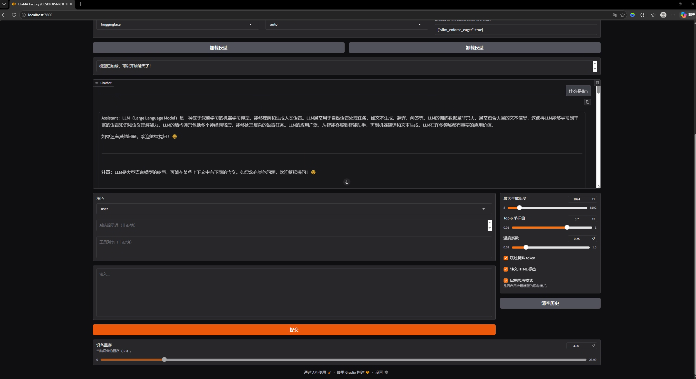
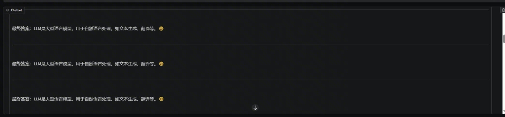
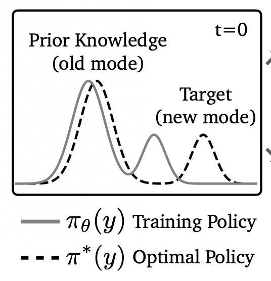
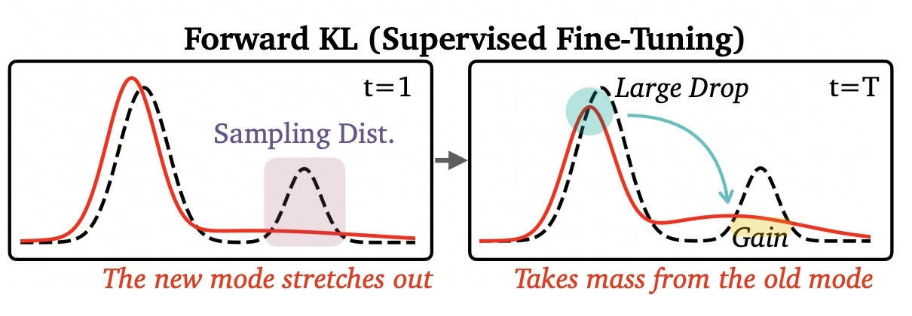
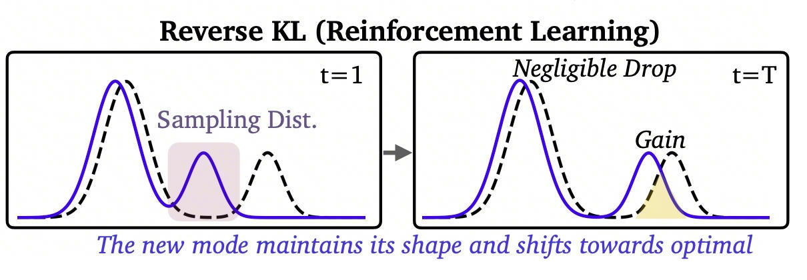
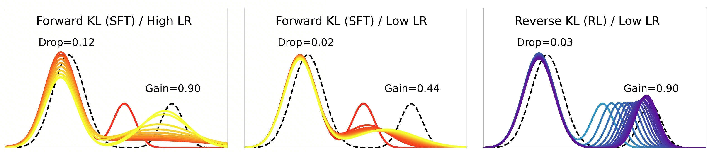

# 聊聊后训练

---

## 引言
现代的大语言模型往往经历三个阶段的训练：
1. 大规模预训练；
2. 监督微调； 
3. 强化学习；

其中，我们通常将大规模预训练视为pre-train，后两个阶段以及对齐垂域任务相关的训练视为post-train（当然，现在其实分为pre mid post，这里为了简化概念，我们仍然看作是两个阶段）。今天我们梳理梳理，SFT和RL阶段，模型究竟在训练什么？

---

## 一切的前提

在聊SFT与RL前，我们首先将视野聚焦于pre-train阶段--这个为模型的能力进行奠基，决定模型能力上限的阶段。我们可以看看以下表格：

| 模型 | 参数量 | 预训练成本（计算） | 数据来源 |
|------|--------|-------------------|----------|
| Transformer (2017) | — | ~$900 | Stanford AI Index |
| GPT-3 (2020) | 175B | $460万–$500万 | OpenAI / 多方估算 |
| GPT-4 (2023) | 未公开 | $7,800万–$1亿+ | Stanford AI Index 2025 |
| Google Gemini Ultra 1.0 | 未公开 | ~$1.91亿 | Epoch AI / Stanford AI Index 2025 |
| Meta LLaMA 3.1 405B | 405B | ~$1.7亿 | Epoch AI |
| DeepSeek-V3 | 671B (21B active) | $557万（2.788M H800 GPU hours） | DeepSeek 技术报告 |

**增长趋势**：从 2017 年 Transformer 的 $670 到 2024 年 Gemini Ultra 的 $1.91 亿，前沿模型训练成本增长了约 **287,000 倍**（Stanford AI Index 2025）。训练成本以每年 2–3x 的速度增长（Epoch AI）。

在这个阶段，模型通过大规模的在大量语料上的无监督训练，粗略的看，我们可以认为模型获得了以下几种能力：

* 基础的语言理解能力：懂句法，懂词语含义
* 对于下一个词元的预测能力：基于语言理解，知道如何“文字接龙”
* 思维链能力：面对复杂问题，可以在自然语言层面进行逐步拆解分析的能力

经过这个阶段的训练，部分能力已然有所展现，例如“文字接龙”。

当你对预训练的模型输入一句话：什么是llm,你很有可能看到如下的情况：

可以看出来，模型此时具有因果语言能力，但是无法遵循基本指令。这里我们不解释该现象出现的原因，大家可以自行调研。

---
## 引入后训练

为了使得模型能够听懂指令，按照人的偏好进行文本生成，我们引入了监督微调与强化学习的训练方式对模型进行训练。

### 简化的视角

在预训练的基础上，我们从这个视角来看待模型的输入与输出：

* 输入：一只猫坐在

模型通过计算，输出了以下的分布：

|词语|垫子上|水杯里|
|---|---|---|
|概率|0.2|0.8|

于是我们通过对这个分布采样，采样到了“垫子上”，这个词语（假设）

也就是说，对于模型的每一次输出，我们都可以看作是一个分布。

而我们训练所使用的数据集里，通过统计，我们得到，“一只猫坐在”这一句话后，跟着的词语频率：

|词语|垫子上|水杯里|
|---|---|---|
|频率|0.8|0.2|

我们使用数据集对模型训练，是因为我们希望模型能从数据集中学到“知识”，这是对于训练的直观解释，而从数学的角度来看，不妨看作是：**对齐两个分布** 。

### 对齐的手段

对于这两座小山，我们希望他们能尽可能的重叠，这样模型的回复才倾向于将小猫放置在垫子上。但是如何才能做到呢？我们需要改变什么才能使得分布向相似的方向变化？

由于分布是模型产生的，我们知道“一只猫坐在”这句话输入进模型，通过一系列的运算产生了这个分布，而这一系列的运算是基于输入与模型本身的参数进行的，所以调节模型的参数，就可以改变输出的分布。

但是我们不只是希望**改变**输出分布，而是希望输出的分布能够**贴近**数据集的分布，因此这本质上是个优化问题。

对于这个优化问题，我们采用了Gradient Descent，即梯度下降的优化方式，拉近这两个分布间的距离。简单来说，将所有的模型参数作为自变量，比如：x1, x2, x3...xn;将一个可以衡量分布间距离的指标作为因变量（即我们所谓的loss），比如：MAE；我们可以将上述文字翻译为数学语言：

$$ loss = f(x_1, x_2, ..., x_n) $$

>小小的思考:为什么把模型参数看作自变量，而不是输入的数据呢？输入的数据不是每次都在改变吗？Andrej Karpathy的这个仓库也许会帮到你：[micrograd](https://github.com/karpathy/micrograd.git) 视频教程：[youtube](https://www.youtube.com/watch?v=VMj-3S1tku0)

现在假设loss越小，两个分布之间的距离越近，我们可以通过求导的方式，沿着该函数梯度的反方向前进，从而减小loss值。

这里其实会引出很多的问题，比如：走多少？一直走一个方向吗？走的步伐幅度一直不变吗？上次分享的文档里咱们聊过这些问题。

### SFT 与 RL各自的特点

我们说，训练的本质就是对齐分布，通过数学方法把两个分布的距离拉近，让“小山”尽可能的重叠。这种说法看起来是很简单的，本质上我们的确是在做这样一件事。

但是基于梯度下降的方法改变模型输出分布的方式是有很多种的：在改变模型输出分布这件事情上，不同方法拥有各自的特点。我们从这些特点出发，聊一聊SFT和RL。

#### SFT

下面稍微硬核一点点。

---

SFT的损失函数为交叉熵损失函数：

**完整形式（带 loss mask）：**

$$\mathcal{L}(\theta) = -\frac{1}{\sum_{t=1}^{T} m_t} \sum_{t=1}^{T} m_t \cdot \log P_\theta(x_t \mid x_{<t})$$

其中：
- $\theta$：模型参数
- $x_t$：序列中第 $t$ 个 token
- $x_{<t}$：第 $t$ 个 token 之前的所有 token
- $P_\theta(x_t \mid x_{<t})$：模型预测第 $t$ 个 token 的条件概率
- $T$：序列总长度
- $m_t \in \{0, 1\}$：mask 标志位
  - $m_t = 0$：prompt/instruction 部分，**不计算损失**
  - $m_t = 1$：response 部分，**计算损失**

**展开到 logits 层面：**

$$P_\theta(x_t \mid x_{<t}) = \frac{\exp(z_{x_t})}{\sum_{v=1}^{V} \exp(z_v)}$$

其中 $z_v$ 是模型最后一层输出经线性层映射后的 logit，$V$ 是词表大小。代入后等价于标准的 softmax cross-entropy。

---

以上的公式对于SFT的过程刻画的是最准确的，但是也许我们可以用另一种方式去理解：

SFT的过程，就是让模型输出某个词语的概率尽可能大，为此，模型原本的分布会倾向于被“向上抬”

#### RL

---

常见的RL方法的损失函数如下，以PPO为例：

**策略优化目标：**

$$\mathcal{L}^{\text{PPO}}(\theta) = -\mathbb{E}_t \left[ \min \left( r_t(\theta) \hat{A}_t, \; \text{clip}\left(r_t(\theta), \; 1-\epsilon, \; 1+\epsilon \right) \hat{A}_t \right) \right]$$

其中：

- $r_t(\theta) = \dfrac{\pi_\theta(a_t \mid s_t)}{\pi_{\theta_{\text{old}}}(a_t \mid s_t)}$：新旧策略的概率比
- $\hat{A}_t$：优势函数估计（通常由 GAE 计算）
- $\epsilon$：裁剪系数，通常取 $0.1 \sim 0.2$
- $\text{clip}(\cdot)$：将概率比限制在 $[1-\epsilon, \; 1+\epsilon]$ 内，防止策略更新过大

**奖励信号（带 KL 惩罚）：**

$$R(x, y) = R_\phi(x, y) - \beta \cdot \text{KL}\left[\pi_\theta(y \mid x) \;\|\; \pi_{\text{ref}}(y \mid x)\right]$$

其中：
- $R_\phi(x, y)$：Reward Model 给出的奖励分数
- $\pi_{\text{ref}}$：SFT 后的参考策略（冻结）
- $\beta$：KL 惩罚系数，防止策略偏离参考模型过远

**优势函数（GAE）：**

$$\hat{A}_t = \sum_{l=0}^{\infty} (\gamma \lambda)^l \delta_{t+l}, \quad \delta_t = r_t + \gamma V(s_{t+1}) - V(s_t)$$

---

我们同样的从分布的角度出发看RL对于模型输出的影响：实际上，RL往往会将模型输出分布整体“往下压”。因为RL本质是奖励正确，惩罚错误，这意味着模型输出的分布将会更加保守：对于一些**可能会**被惩罚的词语，统统调低概率。

#### 导致的结果

我们会发现，RL之后的分布，相较于SFT之后的分布，更贴近于目标分布，并且可以良好的保留原本分布的形状。

## SFT与RL区别的本质
### ON-policy or Off-policy
#### 什么是on-policy

一句话解释，就是模型训练用的数据来自于自己。比如RL，先让模型自己推理生成一段话，然后对该段话进行打分，以最终的分数作为指标，通过梯度下降使得分数最大。从分布的角度来看，模型用来训练的数据是从自己输出产生的分布里采样的。

#### 什么是off-policy

跟on-policy相反，模型的训练的数据来自模型外，比如SFT。打个比方就是，把正确答案背下来，书读百遍，其义自现。这里的“书”当然不可能是模型自己写的。从分布的角度来看，模型用来训练的数据跟自己的输出的分布可能大相庭径。

### 区别在哪里

正如上面的文字所叙述的，两种方式最大的不同就是训练用的数据，即目标分布是否来自模型本身，而训练是为了对齐目标分布与模型的输出分布，训练像是一条路径，不同的训练是不同的路径，通往一个确定的目标分布：

* RL通过**修正**自身分布去贴近目标分布，

* SFT通过**拟合**目标分布去改变自身分布

可见两种策略的出发点是不同的，也就是上面所说的通往目标分布的训练路径不同。

## 取舍

我们上面分析了ON-policy 与 Off-policy两种策略的区别，实际上两种训练策略的运用往往是要考虑到诸多因素的，需要根据各自的特点进行选择。

### on-policy的优劣

#### 优点

模型直接从自身的错误中学习，能够更直接地避免犯错，即模型明确的知道输出分布中哪些词语的概率该高，哪些词语的概率该低

#### 缺点

奖励信号极其稀疏，无论模型生成的序列有多长，这个序列始终只能得到一个打分，我们根本不知道生成的这句话中哪些词语高分，哪些词语低分，因此我们说奖励信号是稀疏的。

### off-policy的优劣

#### 优点

奖励信号密度高，例如SFT，本质上是跟one-hot数据对齐分布，反向传播时，我们完全清楚哪些词语的概率应当被调高

#### 缺点

分布飘移导致的复合误差（compounding error）。

我们把SFT类比为了“死记硬背”，那就说明对于书上没有出现过的问题，模型很难答对。这跟三个因素有关：

* 自回归的推理特性
* 训练推理数据不一致
* 采样限制

## 两手抓，两手都要硬

能不能结合这以上两种方式的优点，扬长避短呢？当然可以，On-policy Distillation该登场了。

不过，我们下次分享再聊。
