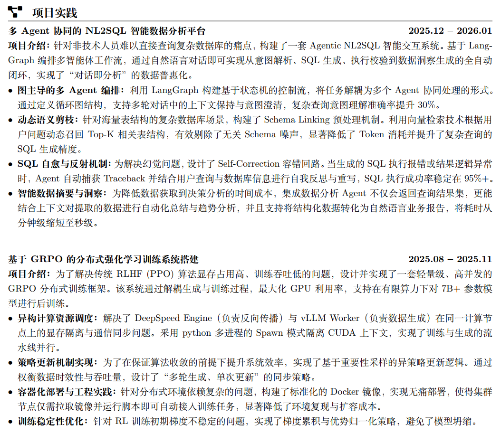

# 字节数仓开发实习一面反思
## 流程
* 自我介绍
* 拷打项目
* 八股
* 手撕代码
* 反问
## 逐流程分析
### 自我介绍
这个环节一般由面试者主动发起，应当介绍自己基本的个人信息，接受面试的原因，自己的意向，以及项目经历的梗概，时长控制在1分钟。

**实际的情况**：我仅仅是介绍了姓名，目前在学校就读的基本信息，然后说我是来面试这个数仓实习的位置的。整个过程就不到30s，面试管也很惊讶说：“这就结束啦？”

### 拷打项目
**项目概览**：

**实际的情况**：
* 我的简历上写了两个项目，面试官只问了第一个，因为第一个项目是我针对数仓开发结合Agent写的一个项目，具体而言是一个NL2SQL的agent工作流。第二个项目是一个从零实现的GRPO分布式多进程训练框架的开发，跟面试的职位方向不沾边。

* 针对于第一个NL2SQL项目，面试官让我假设面对一个什么都不知道的人，叙述清楚整个项目的工作流程。叙述完毕后问题接踵而至。

* 面对这个项目流程，面试官首先针对于项目中的agent的sql纠正发问，询问具体的纠正方式，是如何做这个纠正的。我的回答是通过另一个Agent纠正，这个Agent生成的sql语句会经过下一个工作流节点，而这个节点正是另一个具有sql验证工具的Agent，如果验证了没问题，就继续流程，如果有问题，返回给生成sql的Agent。
* 面对这个回答，面试官给出追问，“这个纠正是否只能纠正sql语法问题”，我的回答是不仅仅，因为用户的Query是放在一个全局变量中，所有的节点都可以访问到，因此可以把用户的Query加入到纠正sql的Agent的上下文中，结合生成的sql进行逻辑上的验证。
* 面试官再次抛出问题，“如何解决表结构过于复杂的情况下token占用过多的问题”，我的回答是，“这个问题是nl2sql走向产品落地的一个最难搞的问题，我没本事解决”
* 面试官追问，“你觉得能用什么办法解决呢”，我的回答是，“可能通过提前将表结构等信息存入.md文档中，基于Agent Skill这种技术去做”，但是最终面试官还是否定了这个提案，原因是公司内部的好多数据表是时常变动的，静态的储存不现实。
* 整个流程可能就十来二十分钟。

### 八股
跟项目无关的我都放在这个板块，不一定是八股。
1. 你平常了解过的大模型，比如GPT以及Gemini之类的，你觉得他们各自擅长的工作是什么？

    答：因为GPT和Gemini这类的模型在各种语言的语料上的训练不同，因此他们对于不同的任务会有不同的表现。一般而言我喜欢用Gemini去做文献调研和coding，毕竟谷歌专门为Gemini配置了DeepReserch的功能，可以抓取全网的信息做文献调研与总结；GPT一般是拿去写一些文档。
2. 这个项目的模型是你调用的api还是本地自己搭建的？

    答：本地运行的Qwen3-8B，教研室不批钱买不起api。

3. 大数据开发了解过吗？

    答：宽泛的了解过。

4. 数仓的特点知道吗？

    答：不知道。

5. 大数据常用的技术栈知道吗？

    答：不知道。

整个流程极快，因为数据开发的我基本都不知道咋回答。

### 手撕代码

最长无重复字符串

**一些细节**：大概五六分钟写完第一版代码，面试官让我讲一下编码思路，我讲完之后他提了一个反例，我意识到第一版代码出现问题，然后大概三分钟时间写出第二版代码，继续讲解编码思路，期间面试官追问有反例吗，我说应该是没有了。

整个流程在接近20分钟，主要集中在代码思路的讲述上。

### 反问环节
这是解决了我最近一两个月一直苦恼的问题，即脱产环境的架空项目思维和实际生产的业务导向考虑之间的矛盾。

1. 我想知道您在实际的业务场景中从事开发工作这么多年，能不能从业务的角度来看我之前的发言有何缺点，不必含蓄，直言不讳即可。

    面试官回答：你不必去思考这个问题，在学校是为了接轨前沿的先进技术，在工作是为了将技术落地到实际，你现在还处于在学校这个阶段。如果我们要找有经验的，为何不通过社招而要校招找呢。重要的是要有更新鲜的更优秀的血液涌入，带来前沿的技术，然后再将技术投入到生产。

2. 咱们这个部门的业务我有了解过是做企业内部人事管理的数据开发工作，您能为我讲讲具体是要做什么吗？

    面试官回答：业务场景相关，略。（简单理解就是对于考勤等等的指标变化，异常的case能通过分析数据得出原因，帮助管理层决策）

3. 关于学校与公司的闲聊

十分钟

## 总结
* 整个环节下来我感觉面试其实是一点不紧张的，我一直在输出自己关于项目，关于代码的思维，而且涉及到数仓开发这个我根本不了解的场景，就算我一直说不知道，面试官也没有压力或者刁难。最关键的是手撕代码这个基本的代码能力要求上，我第一版代码其实是写错了的，说实话有点紧张了，但是面试官是引导我纠正代码不合理的地方最终完成这个题目。因此手撕代码这部分我们可以认为你的**coding idea**是大于**coding**的，你可以犯错，但是你犯了错能够及时纠正回来并且能说明原因，这是一种解决问题的最基本能力。所以学习算法题最重要的是要掌握方法，而不是死记硬背或者投机取巧。这种能力的考察是手撕代码环节的核心。而项目经历在一个实习岗位的面试中可能确实只能算加分项，我的项目跟玩具没啥区别，但是面试官并没有过多的指责或者嫌弃，反而是更希望看到面试者关于项目中的技术思考，更愿意去发掘面试者本身具备的解决问题的能力。

* 然后是一些关于最近最关心的问题的思考：

   1. 高校的科研环境是脱产的，是架空整个业务背景而去做一些更极致的优化的过程，举个例子就像是大炮上雕花。我们不能说这样的工作没有意义，相反是意义巨大的，因为有这种前沿技术的跟进才会诞生更多的面对相同问题的新颖方法，比如大炮雕花，雕在外面是花，雕在里面是膛线。有了更多的新颖的方法，然后在业务背景的基础上去进行贴合，才会诞生出更多的能指导生产实践的方法。

    2. 这个问题其实大家或多或少都懂，但是在找工作时大家发现可能却不是这样。大家发现就连找个实习都要求项目有业务背景，有数据指标，要求面试者在之前就有过这个方向的工作经历。但是本来就是投的实习面试，不实习没有经历，想实习又要经历，这两者直接闭环，问题无法得到解决。

    3. 但是在我与这位面试官对谈的短暂时间里，我也突然意识到也许这本就不合理，也许是我们缺少了实践的经验（没面试过），缺少了关键信息的来源（没投入工作，没人分享这些东西）等等因素，导致了我们认为这个问题是闭环的。

    4. 实际上可能本来就得一步一步来。可能有些人教研组的资源很好，跟老师和外面企业联手做过一些落地生产的项目，但反正我们是没有。没有实习的话项目经历就用开源项目，结合自己的思考进行改进，想一想这个项目具体要解决的问题，关键难点，你的方法等等。就算是某些面试官比较看重这个，认为你没有业务背景相关的经验就是差的，然后给你挂了，那又何必去惋惜，因为你其实已经做到了能做的大多数事情了，他不要你，那么继续反思，继续打磨自己，然后下一次做好就行，机会是不会这么少的，重要的是要在机会来临时有这个能力去把握住。

